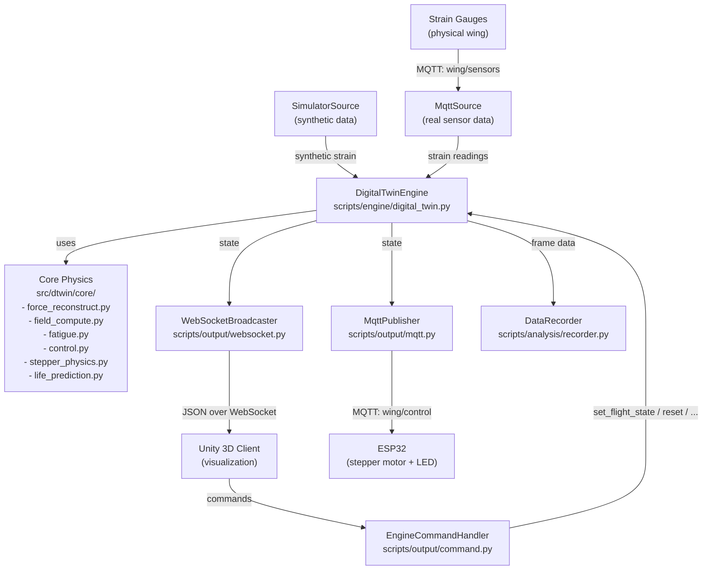

# Wing Digital Twin

Real-time wing digital twin that reconstructs forces from strain gauges via FEA transfer matrices, computes full-field stress/deformation, and accumulates fatigue damage using rainflow counting and Miner's rule.

## Setup

```bash
# Clone and install
pip install -e .

# With dev dependencies
pip install -e ".[dev]"
```

Requires Python >= 3.10. Dependencies: `paho-mqtt`, `numpy`, `scipy`, `websockets`, `py_fatigue`, `matplotlib`, `h5py`, `vtk`.

## CLI Commands

| Command | Description | Equivalent |
|---|---|---|
| `wing-demo-run` | Run with simulated sensor data, optional WebSocket + Unity | `python -m scripts.cli.demo` |
| `wing-real-run` | Run with real MQTT sensor data from physical wing | `python -m scripts.cli.run` |
| `wing-simulator` | Standalone MQTT sensor simulator publishing to broker | `python -m scripts.cli.simulator` |
| `wing-mesh-export` | Convert VTK-HDF mesh to JSON for Unity | `python -m scripts.cli.mesh_export` |

### Flags

**wing-demo-run** (`python -m scripts.cli.demo`)

| Flag | Description |
|-|-|
| `--duration SEC` | Simulation duration in seconds (0 = infinite, default 30) |
| `--run` | Run indefinitely until Ctrl+C |
| `--headless` | Run without WebSocket |
| `--record` | Record data to HDF5 during run |
| `--figures [DIR]` | Generate PNG figures after run (optional: output dir, default: figures/) |
| `--figures-only [DIR]` | Regenerate figures from saved data (optional: data dir) |
| `--resume DIR` | Resume from prior run directory |
| `--seed N` | Random seed for reproducibility |

**wing-real-run** (`python -m scripts.cli.run`)

| Flag | Description |
|-|-|
| `--broker HOST` | MQTT broker address (default localhost) |
| `--port PORT` | MQTT broker port (default 1883) |
| `--record` | Record data to HDF5 during run |
| `--figures [DIR]` | Generate PNG figures (optional: output dir, default: figures/) |
| `--figures-only [DIR]` | Regenerate figures from saved data (optional: data dir) |
| `--resume DIR` | Resume from prior run directory |

## Project Structure

```
pyproject.toml            Package config and entry points
environment.yml           Conda environment definition
mosquitto.yml             MQTT broker configuration

src/dtwin/                Installed package
  __init__.py             Re-exports core public API
  core/
    matrices.py           Load FEA transfer matrices (H, H_inv, S, U)
    force_reconstruct.py  Reconstruct forces: F = H_inv @ strain
    field_compute.py      Compute stress/deformation: S@F, U@F
    fatigue.py            Rainflow counting, Miner's damage, confidence
    control.py            LED / speed decisions from damage
    stepper_physics.py    Aerodynamic force (thin-airfoil theory)
    life_prediction.py    Remaining cycles estimation

scripts/                  CLI and engine (not installed as package)
  __init__.py
  types.py                Shared DataSource / SensorReading types
  settings.py             I/O config (MqttConfig, SimulationConfig, file paths)
  logger.py               Logging setup (WING_TWIN_LOG_LEVEL)

  engine/
    digital_twin.py       DigitalTwinEngine (strain -> forces -> stress/deformation -> fatigue damage)
    state.py              TwinState (for_unity / for_esp32 serialization)
    config.py             EngineConfig (flight envelope, wing geometry, safety limits)

  sources/
    mqtt.py               MqttSource (reads real sensor data via MQTT)
    simulator.py          SimulatorSource (generates synthetic strain)

  output/
    websocket.py          WebSocketBroadcaster (pushes state to Unity)
    mqtt.py               MqttPublisher (sends control to ESP32)
    command.py            EngineCommandHandler (WebSocket commands from Unity)

  mqtt/
    client.py             Shared MQTT client base
    handler.py            Parses incoming sensor messages

  mesh/
    exporter.py           Extracts surface mesh from VTK-HDF to JSON

  analysis/
    recorder.py           Incremental HDF5 recording
    loader.py             Load recorded data for post-processing

  viz/
    generator.py          Figure generation from recordings
    base.py, strain.py, damage.py, rainflow.py, sn_curve.py, fields.py

  cli/
    run.py                wing-real-run
    demo.py               wing-demo-run
    simulator.py          wing-simulator
    mesh_export.py        wing-mesh-export
    _lifecycle.py         Shared asyncio lifecycle (recorder, signals)

esp32/
  firmware.ino            ESP32 Arduino firmware (stepper + LED)

unity/WingTwinUnity/      Unity 6 project (3D visualization)

transfer_matrices/        Pre-computed FEA matrices (.npy)
  H.npy, Inverse_H.npy, EquivalentStress.npy, TotalDeformation.npy

mesh/                     Wing mesh files
  FinalMesh.vtkhdf        Full FEA mesh
  FinalMesh_surface.json  Surface mesh exported for Unity
```

## Architecture



### Data Flow

1. **Strain** arrives from physical gauges (MQTT) or a simulator
2. **Forces** are reconstructed via `F = H_inv @ strain` (pseudoinverse of strain sensitivity matrix)
3. **Stress** and **deformation** fields are computed: `sigma = S @ F`, `u = U @ F`
4. **Fatigue damage** accumulated via rainflow cycle counting + Miner's rule per critical node
5. **Confidence** tracked via EMA-filtered residual between observed and expected strain
6. **Life prediction** estimates remaining cycles based on damage rate
7. **Control decisions** (LED state, speed limit) are made from damage/confidence/stress
8. **State** is pushed to **Unity** (WebSocket) for 3D visualization and to **ESP32** (MQTT) for hardware actuation
9. **Commands** from Unity (set flight state, reset damage, change heatmap mode) are handled by `EngineCommandHandler`

### Transfer Matrices

Pre-computed from Ansys FEA with unit force (1 N):

| Matrix | Shape | Maps | Units |
|---|---|---|---|
| `H` | (n_gauges, n_forces) | Force -> strain | dimensionless |
| `H_inv` | (n_forces, n_gauges) | Strain -> force | N |
| `S` | (n_nodes, n_forces) | Force -> stress | Pa |
| `U` | (n_nodes, n_forces) | Force -> deformation | m |

## Usage Examples

```bash
# Demo run with simulated data (30s, WebSocket on for Unity)
wing-demo-run --duration 30

# Demo run headless (no WebSocket, no dashboard)
wing-demo-run --duration 60 --headless

# Demo run with recording and figures
wing-demo-run --duration 120 --record --figures

# Real run with real sensors
wing-real-run --broker 192.168.1.100 --record

# Standalone sensor simulator
wing-simulator --broker localhost
```

## Unity Visualization

The `unity/WingTwinUnity` folder is a **Unity 6** project. It connects to the Python backend via WebSocket and provides a real-time 3D view  and control of the wing.

### Setup

1. Install **Unity 6** via Unity Hub
2. Open `unity/WingTwinUnity` in Unity Hub
3. Open `Assets/Scenes/TwinScene.unity`
4. Press **Play**
5. Unity automatically connects to the WebSocket

### What You See

- **3D wing mesh** with a per-vertex heatmap (blue = low, red = high)
- **HUD** showing damage, confidence, speed, angle of attack, LED status
- **Sliders** to set desired angle of attack and airspeed
- **Charts** (press **C**): strain, damage, stress, rainflow histogram
- **Camera controls**: WASD + right-mouse look
- **Views**: Switch between wing and plane views
- **Heatmap** (press **M** or click toggle): Switch between stress and damage heatmap

### Key Controls

| Key | Action |
|-|-|
| **M** | Toggle heatmap mode (stress / damage) |
| **C** | Toggle live plots |
| **R** | Reset damage |
| **P** | Pause simulation |
| **H** | Toggle help overlay |

The Unity client connects to `ws://localhost:8765`. You need to start the Python backend first (`wing-demo-run` or `wing-real-run`).
