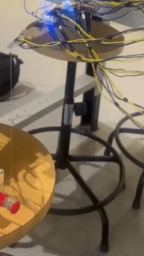
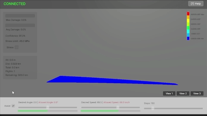

# Wing Digital Twin

A live model of a small wing. Nine strain gauges send data to a Python program
that computes loads, stress, and fatigue. Unity shows the wing in 3D as it
moves. Two ESP32 boards link the hardware: one reads the gauges, one drives
the stepper motor that bends the wing.

| Physical rig | Digital twin |
|---|---|
|  |  |

## Run

```bash
uv sync
uv run wing-demo-run --duration 30   # simulated data, no hardware needed
```

This starts a server on `ws://localhost:8765`. Open
`unity/WingTwinUnity/Assets/Scenes/TwinScene.unity` and press Play.

| Command | Sensors | Hardware |
|---|---|---|
| `wing-demo-run` | simulated | none |
| `wing-hybrid-run` | simulated | stepper and LEDs over MQTT |
| `wing-real-run` | real gauges over MQTT | full rig |

All three take `--record`, `--figures`, and `--resume DIR`. With `--record`,
runs are saved under `recordings/` and can be resumed later or turned into
plots with `--figures`. Use `--broker HOST --port PORT` to point at your MQTT
broker (defaults point at the lab broker). `wing-dashboard` shows live plots
at `http://localhost:5050`.

## How it works

Each step, the engine:

1. Reads the latest strain values, real or simulated.
2. Turns strain into forces with the FEA transfer matrices.
3. Turns forces into stress and deformation fields.
4. Adds fatigue with rainflow counting, per node and overall.
5. Sends the state to Unity over WebSocket and to the ESP32 boards over MQTT.

Start reading at `src/wing_twin/engine/engine.py`. The matrices live in
`transfer_matrices/`.

## Both directions

Data flows both ways. The gauges drive what you see in Unity, and the Unity sliders drive the rig:

- Set angle and speed with the Unity sliders. The engine turns them into safe targets, works out the lift, and moves the stepper motor so the wing bends to match.
- The engine guards the wing while doing it. As damage grows, the allowed stress drops, and requested speed and angle are trimmed so the predicted stress stays under the limit. The HUD shows what you asked next to what is allowed.

## Files

- `src/wing_twin/` - engine, FEA, fatigue, MQTT/WebSocket code, CLI
- `esp32/`, `esp32_stepper/` - sensor board and stepper board firmware
  (PlatformIO; copy `src/secrets.h.example` to `src/secrets.h`)
- `unity/WingTwinUnity/` - Unity 6 project
- `calibration/` - how to calibrate the rig, see the README there. Result
  files stay on your machine and are never committed.
- `transfer_matrices/`, `mesh/` - FEA data and the wing mesh

## License

Apache-2.0, see `LICENSE`.
