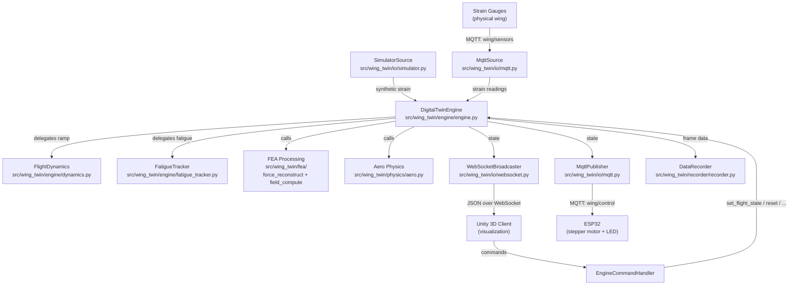

# Wing Digital Twin

Real-time wing digital twin that reconstructs forces from strain gauges via FEA transfer matrices, computes full-field stress/deformation, and accumulates fatigue damage using rainflow counting and Miner's rule.

## Setup

```bash
# Clone and install
pip install -e .

# With dev dependencies
pip install -e ".[dev]"
```

Requires Python >= 3.10. Dependencies: `paho-mqtt`, `numpy`, `scipy`, `websockets`, `py_fatigue`, `matplotlib`, `h5py`, `vtk`.

## CLI Commands

| Command | Description |
|---|---|
| `wing-demo-run` | Run with simulated sensor data, optional WebSocket + Unity |
| `wing-real-run` | Run with real MQTT sensor data from physical wing |
| `wing-simulator` | Standalone MQTT sensor simulator publishing to broker |
| `wing-mesh-export` | Convert VTK-HDF mesh to JSON for Unity |

### Flags

**wing-demo-run**

| Flag | Description |
|-|-|
| `--duration SEC` | Simulation duration in seconds (0 = infinite, default 30) |
| `--run` | Run indefinitely until Ctrl+C |
| `--headless` | Run without WebSocket |
| `--record` | Record data to HDF5 during run |
| `--figures [DIR]` | Generate PNG figures after run (optional: output dir, default: figures/) |
| `--figures-only [DIR]` | Regenerate figures from saved data (optional: data dir) |
| `--resume DIR` | Resume from prior run directory |
| `--seed N` | Random seed for reproducibility |

**wing-real-run**

| Flag | Description |
|-|-|
| `--broker HOST` | MQTT broker address (default localhost) |
| `--port PORT` | MQTT broker port (default 1883) |
| `--record` | Record data to HDF5 during run |
| `--figures [DIR]` | Generate PNG figures (optional: output dir, default: figures/) |
| `--figures-only [DIR]` | Regenerate figures from saved data (optional: data dir) |
| `--resume DIR` | Resume from prior run directory |

## Project Structure

```
pyproject.toml            Package config and entry points
environment.yml           Conda environment definition
mosquitto.yml             MQTT broker configuration

src/wing_twin/            Installed package (wing_twin v2.0.0)
  __init__.py             Package metadata, public exports

  config.py               Unified config dataclasses:
                            EngineConfig, FatigueConfig, MqttConfig,
                            WebSocketConfig, SimulationConfig, ...

  types.py                DataSource (ABC), SensorReading

  physics/
    aero.py               Aerodynamic force (thin-airfoil theory),
                            pitch damping, force_to_steps

  fea/
    matrices.py           Load FEA transfer matrices (H, H_inv, S, U)
    force_reconstruct.py  F = H_inv @ strain
    field_compute.py      sigma = S @ F, u = U @ F

  fatigue/
    fatigue.py            Rainflow counting, Miner's damage,
                            confidence tracking, node damage buffers
    life_prediction.py    Run-to-run remaining cycles estimation

  control/
    control.py            LED / speed decisions from damage or stress

  engine/
    engine.py             DigitalTwinEngine (orchestrator)
    dynamics.py           FlightDynamics (acceleration-limited ramping)
    fatigue_tracker.py    FatigueTracker (strain buffer, cycles,
                            confidence, notifications)
    state.py              TwinState (for_unity / for_esp32 serialization)

  io/
    logger.py             Logging (WING_TWIN_LOG_LEVEL)
    mqtt.py               MqttClientBase, MqttHandler, MqttSource,
                            MqttPublisher
    websocket.py          WebSocketBroadcaster + EngineCommandHandler
    simulator.py          SimulatorSource (synthetic strain data)

  recorder/
    recorder.py           Incremental HDF5 recording + state persistence
    loader.py             Load recorded data for post-processing

  mesh/
    exporter.py           Extracts surface mesh from VTK-HDF to JSON

  viz/
    generator.py          Orchestrates all plotters
    base.py, strain.py, damage.py, rainflow.py,
    sn_curve.py, fields.py

  cli/
    run.py                wing-real-run
    demo.py               wing-demo-run
    simulator.py          wing-simulator
    mesh_export.py        wing-mesh-export
    _lifecycle.py         Shared asyncio lifecycle (recorder, signals)

esp32/
  firmware.ino            ESP32 Arduino firmware (stepper + LED)

unity/WingTwinUnity/      Unity 6 project (3D visualization)

transfer_matrices/        Pre-computed FEA matrices (.npy)
  H.npy, Inverse_H.npy, EquivalentStress.npy, TotalDeformation.npy

mesh/
  FinalMesh.vtkhdf        Full FEA mesh
  FinalMesh_surface.json  Surface mesh exported for Unity
```

## Architecture



### Engine Pipeline (per tick)

1. **Safety limiting** - clamp desired angle/speed to envelope limits, reduce if stress is too high
2. **Flight dynamics** (`FlightDynamics`) - smoothly ramp actual angle/speed toward targets with configurable acceleration limits
3. **Aero force** (`physics/aero.py`) - compute aerodynamic lift + drag + pitch damping from current flight state
4. **Stepper position** (`physics/aero.force_to_steps`) - convert aero force to stepper absolute position for hardware actuation
5. **Sensor read** - get latest strain reading from MQTT or simulator
6. **FEA processing** (`fea/`) - `F = H_inv @ strain`, `sigma = S @ F`, `u = U @ F`
7. **Confidence** (`fatigue.update_confidence`) - EMA-filtered residual between observed and expected strain
8. **Per-node fatigue** (`fatigue.accumulate_damage_at_nodes`) - rainflow + Miner on each critically stressed node
9. **Global fatigue** (`fatigue.accumulate_damage`) - rainflow + Miner on the global strain buffer
10. **Control decision** (`control/`) - LED state + speed limit from damage/confidence/stress
11. **Life prediction** (`fatigue/life_prediction.py`) - estimates remaining cycles based on damage rate (end-of-run)

### Transfer Matrices

Pre-computed from Ansys FEA with unit force (1 N):

| Matrix | Shape | Maps | Units |
|---|---|---|---|
| `H` | (n_gauges, n_forces) | Force -> strain | dimensionless |
| `H_inv` | (n_forces, n_gauges) | Strain -> force | N |
| `S` | (n_nodes, n_forces) | Force -> stress | Pa |
| `U` | (n_nodes, n_forces) | Force -> deformation | m |

## Usage Examples

```bash
# Demo run with simulated data (30s, WebSocket on for Unity)
wing-demo-run --duration 30

# Demo run headless (no WebSocket, no dashboard)
wing-demo-run --duration 60 --headless

# Demo run with recording and figures
wing-demo-run --duration 120 --record --figures

# Real run with real sensors
wing-real-run --broker 192.168.1.100 --record

# Standalone sensor simulator
wing-simulator --broker localhost
```

## Unity Visualization

The `unity/WingTwinUnity` folder is a **Unity 6** project. It connects to the Python backend via WebSocket and provides a real-time 3D view and control of the wing.

### Setup

1. Install **Unity 6** via Unity Hub
2. Open `unity/WingTwinUnity` in Unity Hub
3. Open `Assets/Scenes/TwinScene.unity`
4. Press **Play**
5. Unity automatically connects to the WebSocket

### What You See

- **3D wing mesh** with a per-vertex heatmap (blue = low, red = high)
- **HUD** showing damage, confidence, speed, angle of attack, LED status
- **Sliders** to set desired angle of attack and airspeed
- **Charts** (press **C**): strain, damage, stress, rainflow histogram
- **Camera controls**: WASD + right-mouse look
- **Views**: Switch between wing and plane views
- **Heatmap** (press **M** or click toggle): Switch between stress and damage heatmap

### Key Controls

| Key | Action |
|-|-|
| **M** | Toggle heatmap mode (stress / damage) |
| **C** | Toggle live plots |
| **R** | Reset damage |
| **P** | Pause simulation |
| **H** | Toggle help overlay |

The Unity client connects to `ws://localhost:8765`. You need to start the Python backend first (`wing-demo-run` or `wing-real-run`).

## ESP32 Firmware

The `esp32/` directory contains the Arduino firmware for the ESP32 hardware node. It reads strain gauges via HX711, drives a stepper motor for actuation, controls RGB LEDs, and communicates with the digital twin engine over MQTT.

- **Publishes** sensor data to `wing/sensors`
- **Subscribes** to control commands on `wing/control`

### PlatformIO Workflow

Build, upload, and monitor using PlatformIO from the `esp32/` directory:

| Command | Description |
|---|---|
| `pio run` | Build the firmware |
| `pio run -t upload` | Upload firmware to ESP32 (port: COM3) |
| `pio device monitor -b 115200 -p COM3` | Open serial monitor for interactive shell |

The serial monitor baud rate and port are configured in `platformio.ini` (`monitor_speed = 115200`, `monitor_port = COM3`).

### Interactive Shell

Once connected via serial monitor, the firmware exposes a shell with the following commands:

| Command | Description |
|---|---|
| `help` | Print available commands |
| `stepper set <steps>` | Set stepper motor absolute position |
| `stepper get` | Display current position and target |
| `hx711 read` | Read and print all HX711 strain gauge values |
| `hx711 tare` | Tare (zero) all HX711 channels |
| `home` | Run the zero-calibration routine |
| `leds <r,g,b>` | Set RGB LED colors (e.g., `1_green,2_yellow,3_red`) |
| `status` | Show all states: stepper position, WiFi/MQTT connection, HX711 error count, zero calibration |

### Monitoring the Node

To start interactive monitoring:

1. Connect the ESP32 via USB
2. Run `pio device monitor -b 115200 -p COM3`
3. The firmware outputs status messages and a `> ` prompt for shell commands
4. Type `status` to see the current node state, or `help` for all commands

Behind the scenes, the node automatically publishes sensor data (raw strain, offsets, saturation flags, stepper position) to `wing/sensors` every 1 second. It also auto-zeros the stepper if no MQTT control message is received for 5 seconds. The RGB LEDs provide connection-state feedback: **green** when MQTT is connected, **red** when disconnected.

### MQTT Topics

| Direction | Topic | Payload (JSON) |
|---|---|---|
| Publish | `wing/sensors` | `{"raw": [...], "offset": [...], "saturated": [...], "stepper_position": N, "timestamp": N}` |
| Subscribe | `wing/control` | `{"position": N}` and/or `{"leds": ["1_green", "2_yellow", "3_red"]}` |

### Key Configuration (`esp32/src/config.h`)

| Parameter | Default | Description |
|---|---|---|
| `STEPPER_MAX_SPEED` | 1000 steps/s | Maximum stepper speed |
| `STEPPER_MAX_POSITION` | 2742 steps | Maximum stepper travel |
| `HX711_NUM_ACTIVE` | 9 | Number of active strain gauge channels |
| `PUBLISH_INTERVAL_MS` | 1000 ms | Sensor data publish interval |
| `MQTT_POSITION_TIMEOUT_MS` | 5000 ms | Timeout before auto-zero |
| `WATCHDOG_TIMEOUT_S` | 5 s | Hardware watchdog timeout |
